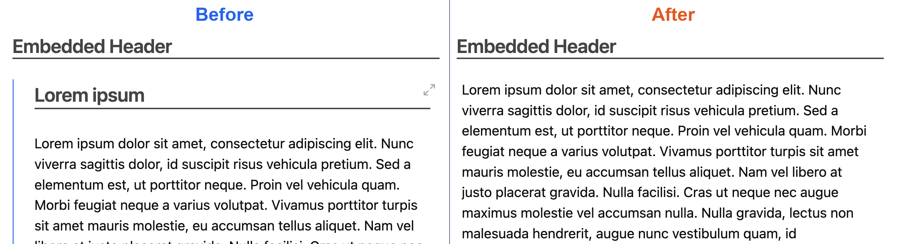

# Quiet Embed

[ [English](https://github.com/jaewonE/quiet-embed) | [한국어](https://github.com/jaewonE/quiet-embed/blob/master/README.ko.md) ]



Quiet Embed makes embedded Markdown notes look like normal document content while keeping a clear way to open the original note.

## Features

- Removes the default embed border, left accent line, and indentation from Markdown note embeds.
- Hides the embed title and the first rendered heading inside each embedded note section.
- Removes the empty top space left by the hidden heading and its rendered wrapper.
- Adds a `1px` accent `box-shadow` outline and a subtle fixed `4px` light/dark-mode-aware gradient on all four edges when an embed is hovered or focused, leaving the center transparent.
- Adds `6px` horizontal padding so embedded text does not sit inside the edge gradient.
- Opens the embedded source note only with Command-click on macOS or Ctrl-click on Windows/Linux.
- Leaves the embedded source note unchanged. The plugin only adjusts the rendered view.

## Usage

Enable the plugin and write a normal Obsidian embed such as:

```markdown
![[note#heading]]
```

The embedded section is displayed without Obsidian's default embed chrome. The rendered heading at the start of the embed is hidden so the embed reads like inline document content.

To open the source note, Command-click the embed on macOS or Ctrl-click it on Windows/Linux. Plain click, double-click, and keyboard interaction do not open the source note.

## Commands And Hotkeys

Quiet Embed does not register commands or default hotkeys.

## Settings

Quiet Embed has no settings in version `1.0.1`.

## Privacy And Network Access

Quiet Embed does not use network access, telemetry, or external services. It does not read files outside the current vault and does not edit vault files. It only inspects and updates rendered Obsidian DOM elements while the plugin is enabled.

## Mobile And Desktop Support

`isDesktopOnly` is `false`. The display cleanup works on mobile-capable Obsidian surfaces, but Command/Ctrl-click navigation is desktop-specific.

## Manual Installation

Copy these files into your vault:

```text
<Vault>/.obsidian/plugins/quiet-embed/
```

Required files:

- `main.js`
- `manifest.json`
- `styles.css`

Reload Obsidian and enable **Quiet Embed** in **Settings -> Community plugins**.

## Development

```bash
npm install
npm run lint
npm run build
```

## License

GPL-3.0.
